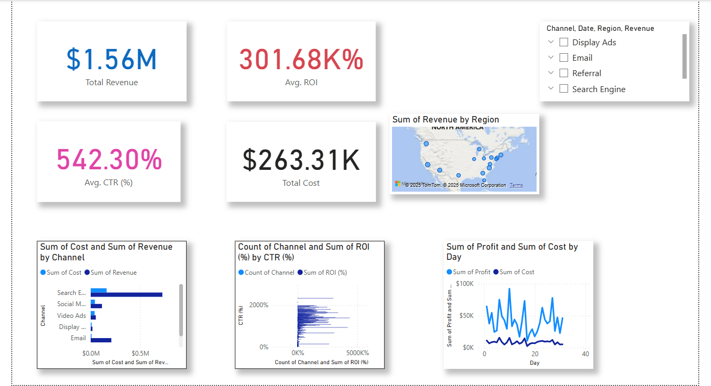

# Marketing Campaign Performance Dashboard Project

## Overview

This project demonstrates a complete data analysis workflow applied to marketing campaign data. It simulates a typical task for a Data Analyst in a digital marketing context, involving data cleaning, feature engineering, exploratory data analysis (EDA), visualization, optional predictive modeling, and dashboard creation. The goal is to derive actionable insights to improve marketing effectiveness.

## Project Goal

To analyze synthetic marketing campaign data to understand performance across various channels and regions, identify key trends, and provide data-driven recommendations for optimization. To showcase skills relevant to a Junior Data Analyst role.

## Dataset

A synthetic dataset (`marketing_campaign_data_raw.csv`) was generated with ~550 rows and the following fields:

* `Campaign_ID`: Unique identifier for the campaign.
* `Channel`: Marketing channel used (e.g., Social Media, Search Engine, Email).
* `Impressions`: Number of times the ad was shown.
* `Clicks`: Number of clicks on the ad.
* `Conversions`: Number of desired actions taken (e.g., purchases, sign-ups).
* `Cost`: Amount spent on the campaign.
* `Revenue`: Revenue generated from the campaign.
* `Region`: Geographical region targeted.
* `Date`: Date of the campaign data entry.

The final cleaned and enriched dataset used for dashboarding is `marketing_campaign_data_cleaned.csv`.

## Technologies Used

* **Python:** For data generation, cleaning, analysis, and visualization.
    * `pandas`: Data manipulation and analysis.
    * `numpy`: Numerical operations.
    * `matplotlib` & `seaborn`: Data visualization.
    * `scikit-learn`: (Optional) For predictive modeling (Linear Regression, Random Forest).
* **Jupyter Notebook:** For interactive analysis and code development.
* **Power BI / Microsoft Excel:** For creating the interactive dashboard.

## How to Run

1.  **Generate Data:** Run the initial Python code block (in `marketing_analysis.ipynb` or a separate script) to generate `marketing_campaign_data_raw.csv`.
2.  **Run Analysis:** Execute the Jupyter Notebook `marketing_analysis.ipynb` cell by cell. This will:
    * Load the raw data.
    * Clean and preprocess it.
    * Engineer features (CTR, CPC, CR, ROI).
    * Perform EDA and generate visualizations.
    * (Optionally) Train and evaluate regression models.
    * Save the cleaned data as `marketing_campaign_data_cleaned.csv`.
3.  **Create Dashboard:** Follow the instructions in `Dashboard_Instructions.txt` to build the dashboard using `marketing_campaign_data_cleaned.csv` in Power BI .

## Key Analysis & Features

* **Data Cleaning:** Handled missing values (median imputation) and checked for inconsistencies.
* **Feature Engineering:** Calculated essential marketing KPIs:
    * Click-Through Rate (CTR %)
    * Cost Per Click (CPC)
    * Conversion Rate (%)
    * Return on Investment (ROI %)
    * Profit
* **Exploratory Data Analysis (EDA):** Analyzed overall performance, metric distributions, and performance breakdowns by:
    * Channel
    * Region
    * Time (Monthly Trends)
* **Visualization:** Created various plots (bar charts, line charts, heatmaps) to illustrate findings.
* **Dashboarding:** Provided instructions to build an interactive dashboard featuring:
    * Key KPIs (Total Revenue, Avg. CTR, Avg. ROI)
    * Channel performance comparison
    * Region-wise performance map
    * Time-series trend chart
    * Slicers for filtering data
* **Actionable Insights:** Summarized key findings and provided recommendations for campaign optimization.
* **Predictive Modeling:** Built simple regression models (Linear Regression, Random Forest) to predict ROI based on campaign features and evaluated their performance.

## Dashboard Preview (Description)

The final dashboard created using Power BI provides an interactive overview of campaign performance. Users can quickly view top-level KPIs, compare how different channels and regions are performing in terms of revenue and ROI, visualize trends over time, and filter the data using slicers to drill down into specific segments.

